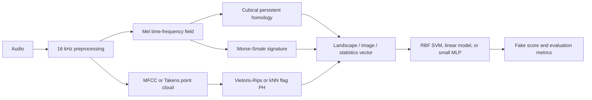

# Topological Audio Deepfake Detection

Research code for detecting synthetic speech with topological descriptors of
audio structure. The project compares cubical persistent homology,
Morse-Smale complexes, point-cloud persistence, and Takens embeddings under
in-domain and cross-dataset evaluation.

The central result is not that one topology wins everywhere. Cubical
persistence is strongest in-domain on ASVspoof-style data, while exact
Morse-Smale signatures are much stronger on MLAAD and transfer substantially
better to In-the-Wild. Mixed-source training reduces some of that dataset
asymmetry but does not eliminate it.

> [!IMPORTANT]
> This is research code, not a production detector or an official challenge
> submission. Results below use fixed internal, bounded, or derived protocols
> documented in the [experiment log](docs/experiment_log.md). Compare numbers
> only when the train/eval protocol is the same.

## Headline Results

Higher AUC and lower equal error rate (EER) are better.

| Train / evaluation protocol | Cubical | Morse-Smale | Main observation |
| --- | ---: | ---: | --- |
| ASVspoof 2019 balanced train (`n=5160`) -> ASVspoof 2021 LA (`n=181566`) | AUC `0.8368`, EER `0.2111` | AUC `0.8390`, EER `0.2041` | Morse-Smale retains slightly more signal under the 2019-to-2021 shift. |
| Full MLAAD English train (`n=84000`) -> test (`n=18000`) | AUC `0.9418`, EER `0.1268` | AUC `0.9886`, EER `0.0303` | MLAAD strongly favors Morse-Smale basin structure. |
| Full MLAAD German train (`n=30800`) -> test (`n=6600`) | AUC `0.8421`, EER `0.2406` | AUC `0.9468`, EER `0.1036` | The Morse-Smale advantage survives the harder language slice. |
| ASVspoof 2019 train -> In-the-Wild (`n=31779`) | AUC `0.4468`, EER `0.5499` | AUC `0.7417`, EER `0.3264` | Morse-Smale is the only tested single-source anchor with useful third-family transfer. |
| Mixed ASVspoof + full MLAAD English -> ASVspoof 2021 LA | AUC `0.8400`, EER `0.2176` | AUC `0.8480`, EER `0.2000` | Mixed-source Morse-Smale is the strongest balanced ASV2021 point in this matrix. |
| Mixed ASVspoof + full MLAAD English -> MLAAD English test | AUC `0.8946`, EER `0.1824` | AUC `0.9760`, EER `0.0688` | Mixed Morse-Smale preserves strong MLAAD performance while recovering ASV transfer. |

Additional findings:

- Low-frequency cubical structure is the most reliable ASVspoof motif. On the
  bounded 2019 setup, keeping the low band reached AUC `0.974` / EER `0.075`;
  on the full 2019 dev holdout it reached AUC `0.966` / EER `0.090`.
- `H1` carries most of the useful low-band cubical signal on ASVspoof. `H2`
  was chance alone and added no measurable value to `H0+H1`.
- MLAAD changes the structural story. Full-field Morse-Smale reached AUC
  `0.9959` / EER `0.0195` on the full English dev split, and the compact
  basin-fraction block retained AUC `0.9856` / EER `0.0308`.
- Topology-only MLPs showed nonlinear headroom, but the staged MLP did not beat
  the strongest tuned classical transfer configurations.
- Takens embeddings produced real but secondary signal; the best bounded run
  reached AUC `0.687` / EER `0.364`.

See the [experiment log](docs/experiment_log.md) for complete tables, sample
counts, ablations, and protocol caveats. The
[sample explanation study](docs/sample_explanation_demo.md) shows how score
changes under field and homology ablations can be used as case-level evidence.

## How It Works



The implemented representation families are:

- **Cubical PH:** treats a processed mel spectrogram as a filtered cubical
  complex and vectorizes `H0`/`H1` persistence with landscapes, persistence
  images, or summary statistics.
- **Morse-Smale:** extracts critical-point, basin, merge-sequence, and entropy
  summaries from the same mel field. Exact experiments use `topopy`; a local
  approximate fallback is also available.
- **Point-cloud PH:** builds physically motivated MFCC/voice-feature
  trajectories and computes Vietoris-Rips or weighted kNN flag persistence.
- **Takens PH:** constructs time-delay embeddings from low-band waveforms or
  energy envelopes before persistent homology.
- **Topology-only neural heads:** compare linear, flat MLP, and staged
  robust-core-first learning over explicit topological feature blocks.

Field controls include compression, smoothing, frequency-band masks,
frame-energy gating, filtration polarity, and homology-specific ablations.
Classifiers consume fixed-length topology vectors rather than raw audio.

## Repository Map

```text
configs/experiments/   Reproducible topology and ablation configurations
data/                  Managed raw data, protocols, caches, and result roots
docs/                  Experiment log, proposal, slides, and explanations
scripts/               Dataset bootstrap and multi-run launchers
src/scripts/           Pipeline, protocol builders, queue workers, and analyses
src/tda_deepfake/      Audio, topology, classification, neural, and utility code
tests/                 Synthetic unit and end-to-end smoke tests
```

Large datasets, feature caches, models, and generated result trees are ignored
by Git. The repository keeps the code, fixed configurations, launchers, and a
curated result record in `docs/experiment_log.md`.

## Installation

Python 3.10 or newer is required.

### Conda

```bash
conda env create -f environment.yml
conda activate tda-audio-deepfake
pip install -e .
```

### Virtual environment

```bash
python3 -m venv .venv
source .venv/bin/activate
python -m pip install --upgrade pip
python -m pip install -r requirements.txt
python -m pip install -e .
```

Verify the environment:

```bash
python scripts/verify_setup.py
pytest -q
```

Exact Morse-Smale configurations require the optional `topopy` and `nglpy`
packages. They are not pinned in the base environment because binary support
is platform-dependent. Without them, select the `morse_smale_approx` complex
or use the cubical, point-cloud, and Takens branches.

## Data Setup

Datasets are not redistributed by this repository. Create the managed layout
inside the clone with:

```bash
python scripts/bootstrap_datasets.py --dataset layout
```

To keep large files outside the clone while preserving repo-local paths:

```bash
python scripts/bootstrap_datasets.py \
  --storage-root ~/tda-audio-deepfake-storage \
  --dataset layout
```

The bootstrapper can prepare the supported public assets:

```bash
python scripts/bootstrap_datasets.py --dataset asvspoof
python scripts/bootstrap_datasets.py --dataset mlaad_tiny
python scripts/bootstrap_datasets.py --dataset in_the_wild
```

Full MLAAD is gated and must be obtained under its own access terms. The full
binary study pairs MLAAD synthetic speech with M-AILABS bona fide speech. Once
both roots are present, inspect the protocol builder with:

```bash
python src/scripts/build_full_mlaad_binary_protocols.py --help
```

Canonical project paths are always `data/raw`, `data/protocols`, and
`data/results`, whether they are directories or symlinks. Disposable feature
caches should live under `/scratch/$USER` or `/tmp/$USER` on compute nodes.

## Run the Pipeline

### Small cubical smoke run

```bash
python -m scripts.run_pipeline \
  --config configs/experiments/ablation/cubical_best_band_keep_low_gate12.yaml \
  --protocol data/raw/ASVspoof2019_LA/derived/ASVspoof2019.LA.cm.train.all_bonafide_balanced.seed42.txt \
  --audio-dir data/raw/ASVspoof2019_LA/ASVspoof2019_LA_train/flac \
  --out-dir data/results/readme_smoke \
  --max-samples 100 \
  --num-workers 4
```

### Held-out train/eval run

```bash
python -m scripts.run_pipeline \
  --config configs/experiments/ablation/cubical_best_band_keep_low_gate12.yaml \
  --train-protocol data/raw/ASVspoof2019_LA/derived/ASVspoof2019.LA.cm.train.all_bonafide_balanced.seed42.txt \
  --train-audio-dir data/raw/ASVspoof2019_LA/ASVspoof2019_LA_train/flac \
  --eval-protocol data/raw/ASVspoof2019_LA/ASVspoof2019.LA.cm.dev.trl.txt \
  --eval-audio-dir data/raw/ASVspoof2019_LA/ASVspoof2019_LA_dev/flac \
  --out-dir data/results/cubical_2019_dev \
  --train-workers 8 \
  --eval-workers 8
```

Replace the config with
`configs/experiments/ablation/morse_smale_best_band_keep_low_k4_norm_none.yaml`
to run the tuned exact Morse-Smale anchor.

Each result directory contains machine-readable metrics and the fitted model.
Train/eval runs normally write `eval_results.json`, `eval_report.txt`, and
`model.pkl`; CV runs write `cv_results.json`.

## Non-Blocking Classifier Queue

Large feature sweeps can enqueue RBF SVM training instead of blocking topology
extraction. The current defaults use `probability=False`, margin scoring via
`decision_function`, `gamma="scale"`, and an 8 GB libsvm cache.

Start queue workers in one terminal:

```bash
QUEUE_ROOT=/tmp/$USER/tda_deepfake_runtime/classifier_queue
scripts/run_classifier_workers.sh \
  --queue-root "$QUEUE_ROOT" \
  --num-workers 2
```

Then add queue mode to any train/eval command:

```bash
python -m scripts.run_pipeline \
  ... \
  --classifier-queue-root "$QUEUE_ROOT"
```

The pipeline writes a feature bundle and `.ready.json` job, then returns so
the next topology configuration can start. Workers atomically move jobs through
`ready`, `claimed`, `done`, or `failed` and write the same normal result
files.

On the 84,000-by-18,000 full MLAAD classifier smoke test, disabling SVC
probability calibration reduced total fit/eval time from about 4 h 46 min to
1 h 14 min with unchanged EER. Raising the libsvm cache from 200 MB to 4 GB
reduced it further to about 1 h 3 min. The shipped default is 8 GB for the
large-memory compute environment used by this project.

## Reproducible Experiment Suites

| Study | Entry point |
| --- | --- |
| ASVspoof 2019 -> 2021 cubical transfer | `scripts/run_cross_dataset_validation_suite.sh` |
| Morse-Smale transfer controls | `scripts/run_morse_cross_dataset_probe.sh` |
| Cubical field and band ablations | `scripts/run_cubical_field_ablation_suite.sh` |
| ASVspoof 2021 DF smoke/follow-up | `scripts/run_df_part1_smoke_suite.sh`, `scripts/run_df_part1_followup_suite.sh` |
| Internal ASVspoof 2021 topology sweep | `scripts/run_la2021_internal_topology_sweep.sh` |
| Topology-only neural models | `scripts/run_topology_nn_suite.sh` |
| Takens low-band sweep | `scripts/run_takens_lowband_sweep.sh` |
| Full MLAAD anchors and diagnostics | `scripts/run_mlaad_full_anchor_subset.sh`, `scripts/run_mlaad_full_morse_compact_diagnostic.sh` |
| Full mixed-source matrix | `scripts/run_mlaad_full_mixed_source_matrix.sh` |
| Weighted mixed-source Morse | `scripts/run_weighted_morse_mixed_source.sh` |
| Score-level cubical/Morse fusion | `scripts/run_score_fusion_suite.sh` |

Most launchers expose paths, sample limits, worker counts, cache roots, and run
tags as environment variables near the top of the script. Use unique result
and cache roots when distributing runs across machines.

## Research Scope and Limitations

- ASVspoof 2021 internal splits and bounded DF subsets are research protocols,
  not official challenge evaluation protocols.
- Full MLAAD binary labels combine synthetic MLAAD with bona fide M-AILABS;
  performance therefore reflects both class and source-corpus differences.
- Cross-dataset results show strong directional asymmetry. High in-domain
  performance does not imply robust transfer.
- In-the-Wild remains difficult: the best tested EER is approximately `0.326`,
  so none of these systems should be treated as deployment-ready.
- The current classifiers operate on utterance-level topology summaries and do
  not localize manipulated spans.

## Documentation

- [Experiment log](docs/experiment_log.md): complete chronological result and
  implementation record.
- [Sample explanation demo](docs/sample_explanation_demo.md): score-shift case
  studies with spectrogram figures.
- [Project proposal](docs/tda-for-audio-deepfake-detection-project-proposal-v1.pdf)
- [Project presentation](docs/tda_presentation.pptx)

## License

Released under the [MIT License](LICENSE). Dataset licenses and access terms
remain those of their respective providers.
