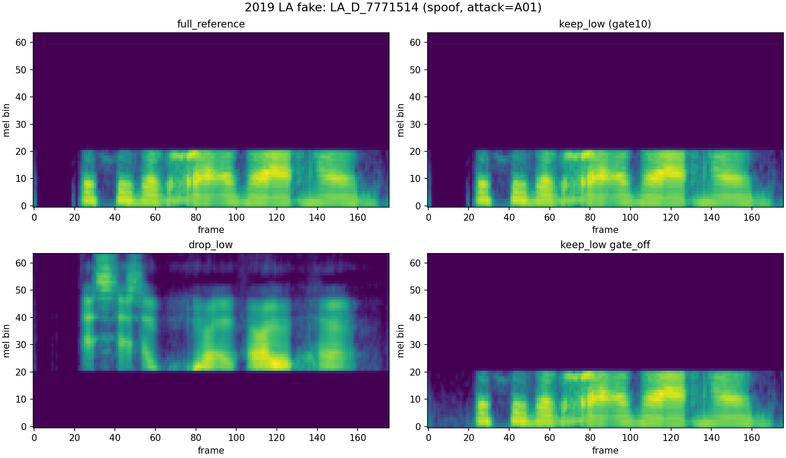
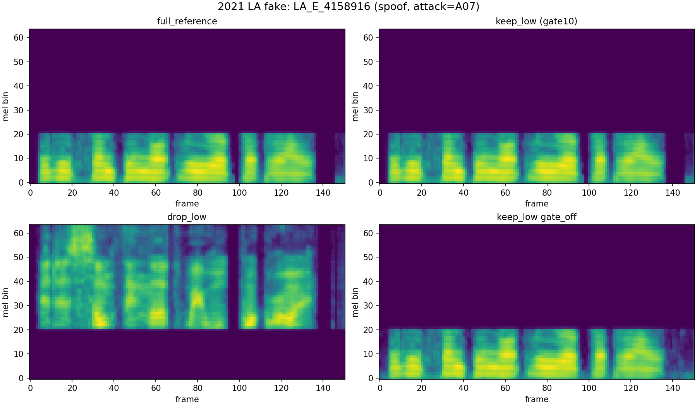
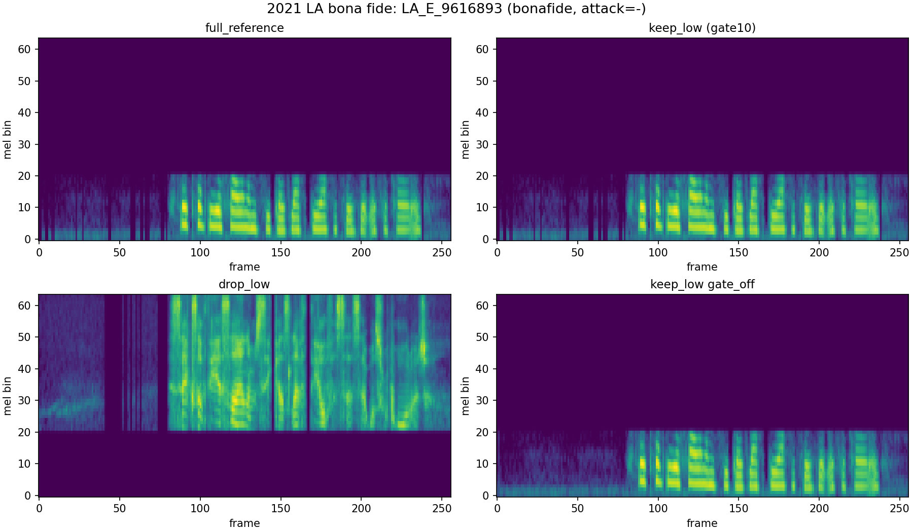
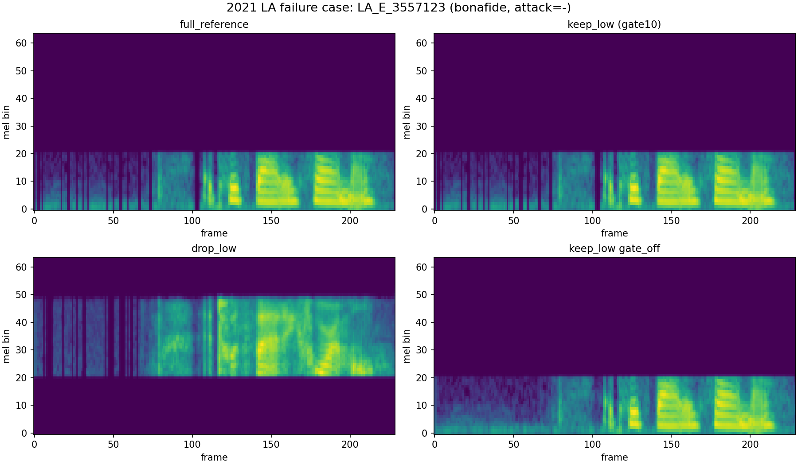

# Sample-Level Explanation Mini-Demo

This bounded demo scores a few representative samples under the most informative cubical branches.
`keep_low` is the gated low-band branch (`gate10`), and `gate_off` is the same low-band field without the energy gate.

Scoring families:
- The `2019 LA fake` row uses the 2019 holdout family trained on the balanced 2019 train subset (`n_train=1000`).
- The `2021 LA` rows use the 2021 internal-split family trained on the bounded internal split (`n_train=20000`, `n_eval=10000` in the sweep runs).
- The missing 2019 `drop_low` branch was materialized on `bg16` with the same 2019 holdout protocol so that the comparison stays complete.

Short read:
- The 2019 fake still shows the earlier low-band / H1 pattern clearly.
- The 2021 fake is easy enough that most variants saturate, so it is less informative structurally.
- The 2021 bona fide sample is the strongest positive explanation example: the full reference and `drop_low` branches score it as fake, while the low-band and especially `H1` branches recover the correct label.
- The 2021 failure case is a useful limitation example because every branch stays on the wrong side of the boundary.

## Score Table

| Case | Dataset | Label | Attack | full_reference | keep_low | drop_low | keep_low_h1 | keep_low_h0 | gate_off |
| --- | --- | --- | --- | --- | --- | --- | --- | --- | --- |
| 2019 LA fake | 2019_LA | spoof | A01 | 0.986 | 1.000 (+0.014) | 0.916 (-0.070) | 1.000 (+0.014) | 0.894 (-0.092) | 0.989 (+0.003) |
| 2021 LA fake | 2021_LA | spoof | A07 | 1.000 | 1.000 (+0.000) | 0.997 (-0.003) | 1.000 (+0.000) | 0.968 (-0.032) | 1.000 (+0.000) |
| 2021 LA bona fide | 2021_LA | bonafide | - | 0.971 | 0.090 (-0.882) | 0.965 (-0.006) | 0.018 (-0.954) | 0.968 (-0.003) | 0.069 (-0.902) |
| 2021 LA failure case | 2021_LA | bonafide | - | 0.995 | 1.000 (+0.005) | 0.982 (-0.013) | 0.988 (-0.007) | 0.968 (-0.027) | 0.991 (-0.004) |

## Case Notes

### 2019 LA fake

- Sample: `LA_D_7771514` from `2019_LA` `dev` (spoof, attack `A01`).
- True-label support: reference `0.986`, keep_low `1.000`, drop_low `0.916`, H1 `1.000`, H0 `0.894`, gate_off `0.989`.
- Low-band emphasis helps this sample: keep_low beats drop_low by `+0.084` support.
- H1 carries more of the useful signal than H0-only here (`+0.106`).
- Gating changes support only slightly (`+0.011`).
- Figure: 

### 2021 LA fake

- Sample: `LA_E_4158916` from `2021_LA` `internal_dev` (spoof, attack `A07`).
- True-label support: reference `1.000`, keep_low `1.000`, drop_low `0.997`, H1 `1.000`, H0 `0.968`, gate_off `1.000`.
- Low-band masking changes support only mildly (`+0.003`).
- H1 and H0-only stay close on this sample (`+0.032`).
- Gating changes support only slightly (`+0.000`).
- Figure: 

### 2021 LA bona fide

- Sample: `LA_E_9616893` from `2021_LA` `internal_dev` (bonafide, attack `-`).
- True-label support: reference `0.029`, keep_low `0.910`, drop_low `0.035`, H1 `0.982`, H0 `0.032`, gate_off `0.931`.
- Low-band emphasis helps this sample: keep_low beats drop_low by `+0.875` support.
- H1 carries more of the useful signal than H0-only here (`+0.951`).
- Gating changes support only slightly (`-0.020`).
- Figure: 

### 2021 LA failure case

- Sample: `LA_E_3557123` from `2021_LA` `internal_dev` (bonafide, attack `-`).
- True-label support: reference `0.005`, keep_low `0.000`, drop_low `0.018`, H1 `0.012`, H0 `0.032`, gate_off `0.009`.
- Low-band masking changes support only mildly (`-0.018`).
- H1 and H0-only stay close on this sample (`-0.020`).
- Gating changes support only slightly (`-0.009`).
- This is the intentional failure case, so at least one branch stays on the wrong side of the boundary.
- Figure: 
